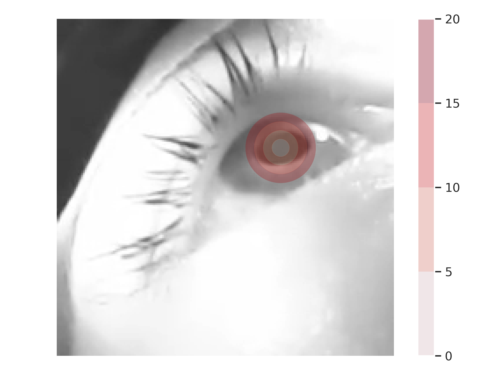
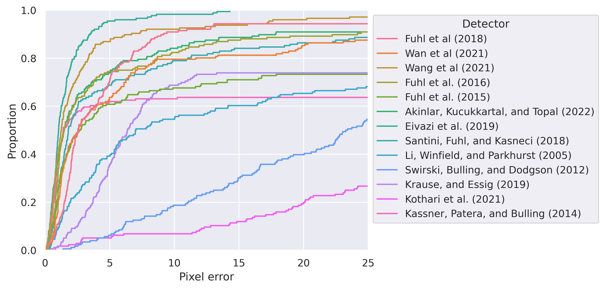
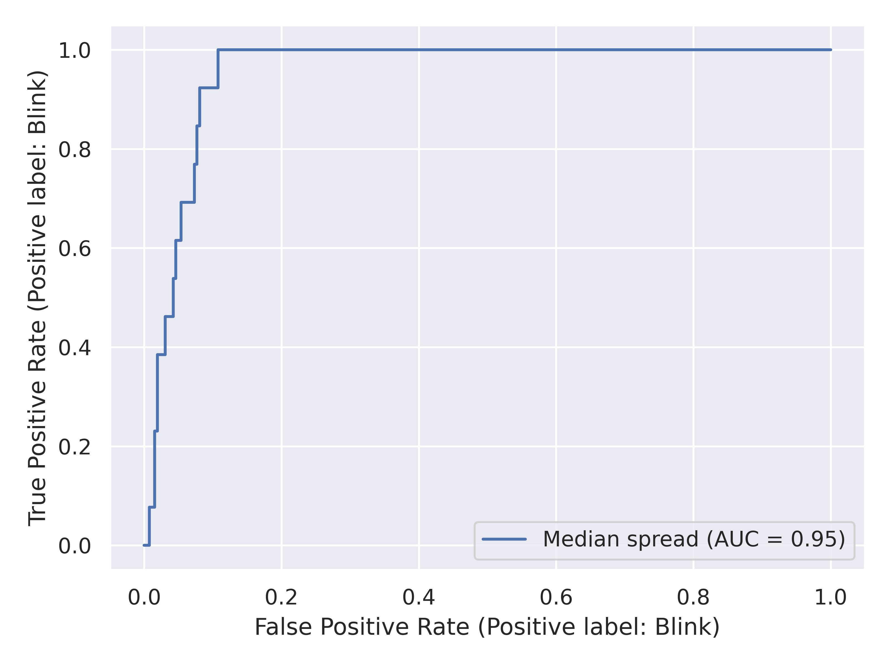

# Introduction
Eye-tracking technology has become pervasive in recording, assessing, and evaluating eye movements, gazes, and pupil reactions across diverse research fields [@punde2017]. Historically, such technology was employed to measure otherwise challenging-to-assess quantities within psychophysiological studies [@steinhauer2022]. However, eye-tracking is now increasingly utilized as a valuable tool for optimizing human-computer interaction and conducting experiments in more applied scientific domains such as medicine [@larrazabal2019]. As the demand for objective measurements continues to grow, research and industry are driven to develop the required eye-tracking technology further. Advancements in this field, resulting in reduced costs, decreased complexities, and improved accuracy, are expected to further enhance the prevalence and significance of eye-tracking technology in the future [@stein2021].

Since the late 19th century, stationary eye trackers have been extensively researched for scientific purposes [@cognolato2018]. More recently, head-mounted video oculography has emerged as a valuable alternative, enabling experimental setups that were previously impossible [@cazzato2020a]. Advancements in optical technology have led to the incorporation of cameras into glasses-like devices or virtual reality headsets, enabling continuous eye recording using non-visible near-infrared light. Unlike proprietary devices used in the past, this technology offers transparency in the recording process and allows for re-evaluation with advances in analysis methods: Affordable off-the-shelf technology is readily available or can be tailored to specific needs [i.e. @zandi2021; @stengel2015]. Consequently, this eye-tracking technology aligns directly with the four principal components of open science [@vicente-saez2018].

Despite the advantages of such flexible and archivable tailor-made solutions, a significant responsibility lies in fine-tuning the factors that influence the recording process. Alongside the physical camera setup, the pupil detection algorithms represent a crucial component of the eye-tracking pipeline. Despite the apparent simplicity of detecting the corresponding blob of pixels in a near-infrared image, this task remains challenging and unsolved. Factors such as contact lenses, dust, makeup, and other external influences further complicate the measurement process [@tonsen2016]. Given the plethora of available algorithms, each with distinct advantages and disadvantages, researchers must carefully choose a suitable method and associated hyperparameters based on their specific research objectives [@chen2019]. This publication aims to provide a framework for making such choices, grounded in reliable evidence and ease of application.

## Choosing the best algorithm for research
Recording and analyzing eye-tracking data present challenges that are far from trivial [@orquin2018]. However, these well-known complexities have resulted in a significant body of published knowledge and advice in the literature [i.e. @steinhauer2022; @godfroid2020]. These insights encompass a wide range of topics, including recording setups and devices [i.e. @stein2021; @cognolato2018], strategies for optimizing data quality [i.e. @kret2019], and proper analysis methods [i.e. @vanrij2019], providing valuable guidance for the appropriate use of this powerful methodology. As a result, researchers who aim to utilize eye-tracking technology can benefit from a rich ecosystem of scientific work that serves as a foundation for their own investigations.

To assist applied researchers in selecting an appropriate pupil detection algorithm for their measurement pipeline, evaluation surveys like @fuhl2016b have been conducted to compare and rate these algorithms. The diversity of potential recording designs has led to the existence of different datasets [@fuhl2021a]. These datasets have been used for training or evaluating pupil detection algorithms, resulting in varying types of labels associated with the samples, depending on the three major types of algorithms.
The most fundamental type of annotation involves detecting the pupil center within the image [@fuhl2016b]. With the two-dimensional coordinates of the detected pupil center and a commonly estimated three-dimensional eye model, subsequent procedures can calculate the corresponding eyeball rotation [@santini2019]. 
In scenarios where pupil size is of interest, such as in pupillography, algorithms typically yield the best-fitting ellipse enclosing the pupil [@zandi2021]. The output provides information on the size of the major and minor axes, along with its rotation and two-dimensional position.
A more versatile representation utilizes a segmentation map covering the entire sample [@fuhl2021a]. This segmentation mask is a binary mask where only the pupil is indicated. Some of these algorithms may also provide data on other eye components, such as the iris and sclera. Theoretically, this encoding allows for the use of partially hidden pupils due to eyelids or blinks.
Importantly, these three different annotation types create a hierarchy of information. The segmentation mask contains the most comprehensive information, but reducing it to an ellipse or even the pupil center is feasible. Researchers rely on large annotated datasets, assuming that algorithms performing well on them will generalize effectively to unseen setups and subjects. This generalization is crucial for practical applications where robustness and reliability are paramount considerations.

The concept of generalizability plays a crucial role in the assumption of algorithm performance [@kothari2022]. However, assuming that sufficient performance on one dataset will translate to sufficient performance on a custom setup is not guaranteed. Several authors, such as @cazzato2020a, have emphasized the importance of custom adaptations to achieve satisfactory performance. These complexities arise from various aspects:

- Recorded samples vary significantly based on camera position, resolution, and distance [@niehorster2020]. As a result, samples from different recording setups are not directly comparable. The non-linear transformation of the pupil when viewed from larger eye angles can present additional challenges to the algorithms [@petersch2021].
- Algorithms often require the setting of hyperparameters that are dependent on the specific samples. Many of these hyperparameters have semantic meanings and are tailored to the camera's position. While reusing published values may suffice if the setups are similar enough, obtaining more suitable detections will likely depend on fine-tuning these parameters.
- The population of subjects may differ considerably. In medical contexts, specific correlated phenotypes may seriously hinder detection rates. There is a scarcity of published work, such as @kulkarni2021, systematically evaluating induced bias in pupil detection. Furthermore, challenges exist even within the general population, as documented in @fuhl2016b. For instance, detecting pupils in subjects wearing contact lenses requires detectors to perform well under this specific condition without introducing bias.
- Metrics used for performance evaluation can vary significantly between studies. Often, metrics are chosen to optimally assess a specific dataset or use case. For instance, the evaluation paper by @fuhl2016b used a threshold of five pixels to classify the detection of the pupil center inside a sample as correct. While this choice is sound for the tested datasets, samples with significantly different resolutions due to another camera setup necessitate adopting alternative concepts.

Given these complexities, evaluating pupil detection algorithms requires careful consideration of their context. Making general claims of superior performance compared to all competitors is challenging. Consequently, custom considerations and evaluations in the application of pupil detection algorithms remain necessary to ensure their appropriate and reliable use in specific setups.

In addition to the hypothetical overall performance, various key concepts influence the decision in favor of one pupil detection algorithm over another. Similar to other machine learning use cases, softer concepts become relevant in the context of eye tracking [@cazzato2020a]. For example, transparency is an important dimension, especially in sensitive medical areas where understanding the reasons behind a specific output becomes crucial for proper interpretation and validation. Another significant consideration is the licensing of the algorithm. Some algorithms may have licensing restrictions that limit their usage to non-commercial purposes. In academic settings, such licenses might be incompatible with classical open-source licenses like the GPL, which require re-licensing under the same terms. This can hinder the proper publication and dissemination required for transparent science. Taking all these factors into account further complicates the process of selecting an appropriate pupil detector beyond its assumed detection performance.

Besides the hypothetical overall performance, other key concepts influence the decision in favor of one or another pupil detection algorithm. Those other factors arise analogously to other use cases of machine learning where softer concepts start to play a role, too.
Transparency is an example of such an additional dimension [@cazzato2020a]. When applied in sensible medical areas, understanding the reasons regarding a specific output might be required.
Another reason is suitable licensing. Some algorithms like @santini2018a are licensed for non-commercial usage only. Even in academia, such a license would be incompatible with classical open-source licenses like the GPL. Their requirement regarding re-licensing under the same terms would probit the proper publication required for transparent science. 
Considering those facts further complicates the appropriate choice of a pupil detector besides the assumed detection performance.

Even with a solid understanding of the literature, selecting the most suitable algorithm for a specific research project poses a challenge. Therefore, empowering applied researchers to choose and customize the best-fitting detector for their research needs is the primary contribution of this paper. Providing a framework that facilitates the evaluation and comparison of pupil detection algorithms could allow them to make informed decisions and enhance the quality and reliability of eye-tracking data analysis.

# Unifying framework for the assessment of pupil detection algorithms
The objective of this publication is to empower researchers across diverse scientific disciplines to independently assess pupil detection algorithms in their experiments. The assessment procedure should be inclusive, user-friendly, and not require in-depth knowledge of the algorithm's technical details or implementation. Under the premise, the researcher should be able to optimize the measurements of their raw experimental data for the sake of more sustainable science.

To uphold these fundamental principles, we have defined essential criteria that any proposed toolkit must meet to effectively support academic practice. Automating the complexities associated with the evaluation process is paramount, minimizing the need for manual intervention. However, to ensure a sustainable and reusable utility, a precise definition of underlying constraints is necessary.

- Flexibility: The proposed framework must exhibit maximum flexibility in its hardware and software environment for seamless execution. It should operate offline without reliance on remote servers, enabling widespread use in all countries. Additionally, the toolkit should not be tied to specific commercial systems that may pose accessibility issues due to license regulations or fees. Applied researchers should have the freedom to use the framework directly on their existing experimental systems, avoiding data duplication, preserving privacy, and simplifying knowledge management. As such, the toolkit should be compatible with a wide range of hardware, including UNIX-based operating systems commonly licensed as Open Source software, as well as the popular yet proprietary Microsoft Windows.
- Ease of Setup: Once the system is available, setting up the toolkit should be straightforward and not require advanced technical knowledge. This may appear trivial but is complicated by the diversity of pupil detection algorithms. Existing implementations often depend on various programming languages and require multiple libraries and build tools, making the installation process challenging and time-consuming. To overcome this, the toolkit must not demand manual setup, facilitating faster and easier archiving of assessment results.
- Scalability: The proposed toolkit must be scalable to handle the large volumes of samples in modern datasets, the diversity of algorithms, and the numerous tunable hyperparameters. Fortunately, the independence of algorithms and samples allows for easy parallelization of detections, enabling efficient utilization of computational resources. The toolkit should be capable of benefiting from a single machine, multiple virtual machines, or even a cluster of physical devices, ensuring efficient exploration of the vast search space.
- Modularity and Standardization: The toolkit should be designed with a modular approach, adhering to established standards and best practices. Embracing existing standards simplifies support and ensures sustainable development. Moreover, adhering to these standards allows for the re-use of individual components within the system, facilitating the integration of selected pupil detection algorithms into the final experiment seamlessly.
- Adaptability for Researchers and Developers: The toolkit should not only cater to researchers employing pupil detection algorithms but also be accessible to developers creating new detectors. By providing valuable insights into the optimization process, developers can enhance their algorithms. Additionally, the toolkit's strictly reproducible nature reduces the risk of inadvertent selection bias in associated publications, fostering sustainable development in the methodological domain.

Given the defined constraints, a setup based on microservices and distributed computing appears highly appealing. The following section will delve into the methodological and technical intricacies of this modular, scalable, and easily adaptable toolkit.

## Selection of the pupil detection algorithms
To ensure a comprehensive and meaningful comparison of pupil detection algorithms, an literature analysis was conducted to gather the currently available implementations. This investigation was built upon an extensive review by @zandi2021, which served as the foundational reference for identifying relevant papers and follow-up publications. Additionally, our own research contributed to the compilation of a collection of 40 algorithms, as shown in Table +@tbl:pupil_detectors.

Please note that while this collection may not be fully exhaustive, it encompasses the majority of algorithms currently employed by researchers in the field. Each algorithm was individually evaluated for inclusion based on specific criteria:

- Availability of Implementations: To ensure reproducibility, the published algorithms had to be accompanied by associated implementations. Although textual descriptions may exist, replicating an algorithm without access to its original implementation can introduce unintended variations, leading to inconsistent results. Therefore, only algorithms with readily available and accurate implementations as intended by the original authors were included.
- Independence of Dependencies and Programming Languages: While no strict enforcement of specific dependencies or programming languages was imposed, a preference was given to algorithms that could be executed on UNIX-based systems. This choice was driven by the desire to avoid proprietary components and promote open-source software. As a result, algorithms solely available as compiled Microsoft Windows libraries without accompanying source code were excluded. Similarly, algorithms implemented in scripting languages requiring a paid license, such as MATLAB, were not included.

| Publication          | Code available? | Programming language |
| -------------------- | --------------- | -------------------- |
| @akinlar2022         | \checkmark      | Python               |
| @xiang2022           |                 |                      |
| @bonteanu2021        |                 |                      |
| @cai2021             |                 |                      |
| @fuhl2021            |                 |                      |
| @kothari2021         | \checkmark      | Python               |
| @larumbe-bergera2021 |                 |                      |
| @shi2021             |                 |                      |
| @wan2021             |                 |                      |
| @wang2021            | \checkmark      |                      |
| @bonteanu2020        |                 |                      |
| @fuhl2020            |                 |                      |
| @han2020             | \checkmark      |                      |
| @manuri2020          |                 |                      |
| @bonteanu2019        |                 |                      |
| @bonteanu2019a       |                 |                      |
| @bonteanu2019b       |                 |                      |
| @bozomitu2019        |                 |                      |
| @eivazi2019          | \checkmark      | Python               |
| @han2019             |                 |                      |
| @krause2019          | \checkmark      | C++                  |
| @miron2019           |                 |                      |
| @yiu2019             | \checkmark      | Python               |
| @fuhl2018            | (\checkmark)    | C++                  |
| @fuhl2018a           | (\checkmark)    | C++                  |
| @george2018          |                 |                      |
| @li2018              |                 |                      |
| @martinikorena2018   | \checkmark      | Matlab               |
| @santini2018         | (\checkmark)    | C++                  |
| @santini2018a        | \checkmark      | C++                  |
| @vera-olmos2018      | \checkmark      | Python               |
| @fuhl2017            | \checkmark      | C++                  |
| @topal2017           |                 |                      |
| @vera-olmos2017      |                 |                      |
| @fuhl2016            |                 |                      |
| @fuhl2016a           | \checkmark      | C++                  |
| @fuhl2015            | \checkmark      | C++                  |
| @javadi2015          | \checkmark      | C++                  |
| @swirski2012         | \checkmark      | C++                  |
| @donghengli2005      | \checkmark      | C++                  |

Table: List of pupil detectors included in our review. {#tbl:pupil_detectors}

Implementations that satisfied the aforementioned criteria were deemed suitable for inclusion within the toolkit. As part of our selection process, we did not impose a requirement for real-time execution of the algorithms, recognizing that offline analyses may be appropriate and necessary for specific experimental setups. To the best of our knowledge, the toolkit incorporates a total of 13 pupil detection algorithms, constituting the most extensive collection available for evaluation purposes. 

## Architecture and design of the toolkit
The proposed toolkit employs a microservice architecture, chosen for its inherent advantages in robustness, scalability, and compatibility. In this architecture, the minimal building blocks are represented as fully autonomous containers, providing self-contained and lightweight visualizations. These containers utilize the existing kernel of the operating systems, rendering complete simulations unnecessary, as seen in virtual machines. Each container encompasses all the essential dependencies required for a specific pupil detection algorithm implementation, encompassing the necessary software components, libraries, data dependencies, and the source code itself. This comprehensive encapsulation of the algorithm's environment eliminates the need for manual installation and configuration, streamlining the deployment process for scientists.

The microservice architecture ensures the autonomy of each container, making them self-sufficient and isolated. As a result, the licensing of the container content corresponds precisely to the included code, enhancing intellectual property protection. This autonomy also contributes to the flexibility and suitability of the architecture in accommodating the diverse range of pupil detection algorithms.

Inspired by industry trends, the design of this architecture acknowledges the collective deployment advantages of autonomous services. Container runtimes, supporting various conditions and requirements, facilitate the execution of individual containers. The concept of hardware is largely abstracted in this setup, allowing seamless utilization of physical hardware, virtual machines, or cloud-based resources. The versatility of this approach enables researchers to harness all available resources, facilitating scalability and enhancing the toolkit's efficiency. As the experiment's computational demands increase, the architecture scales nearly linearly with the available resources, promoting efficient utilization and resource allocation.

Services delivered in the form of containers rely on well-documented interfaces to facilitate interaction. The inner workings of the container implementation remain opaque, treated as a black box. Therefore, communication and data transmission necessitate a robust network stack. One popular choice for application interfaces is the Hypertext Transfer Protocol (HTTP) due to its wide adoption and the availability of corresponding server and client libraries for most programming languages. Additionally, designing interfaces following the Representational State Transfer (REST) style enables human-readable communication with the containers, enhancing compatibility and accessibility. To ensure standardization and interoperability, technologies like OpenAPI allow for the automatic discovery, querying, and testing of available resources. Adhering to these unofficial standards, we designed and expose a unified application interface for all pupil detectors, enabling their flexible use in diverse contexts.

Given the containers with well-defined REST application interfaces, most programming languages support sending samples and receiving estimated pupil data. Consequently, researchers can utilize a container runtime and develop evaluation procedures individually. However, managing the lifecycle of containers and handling input and output operations may become repetitive and cumbersome. To address this, the proposed toolkit offers an optional management tool designed for performance optimization. Controlled through a command-line interface and a user-friendly configuration file, this software facilitates scalable and memory-efficient bulk processing of multiple samples. The obtained pupil estimates, encoded as JSON, then serve as the foundation for specific evaluations conducted by the researcher. This streamlined process simplifies the evaluation of multiple pupil detection algorithms, allowing researchers to focus on the core scientific aspects of their experiments.

# Results: Exemplary use of the framework for benchmarking and fusing multiple algorithms
The notion that a single pupil detection algorithm could universally cater to all scenarios is highly implausible. In this chapter, we present a comprehensive testing procedure utilizing the proposed toolkit to identify an optimal pupil detection algorithm for a given scientific setup. Our objective is not to establish a generalized comparison between algorithms, but rather to pinpoint the most effective solution based on the specific recording setup, participants involved, and observed eye movements. This tailored approach facilitates the selection of an algorithm that ensures accurate and reliable pupil detection results in diverse research contexts, contributing to enhanced precision and reliability in each unique eye tracking study.

As a prototypical example for a research setup, we utilized the collection of eye movement data within a virtual reality environment. The immersive nature of VR often introduces constraints in terms of the camera positioning and angle. For the exemplary utilization of our proposed framework, we utilized a novel dataset originally recorded by eyeTrax GmbH & Co. KG. Prior to data collection, participants provided informed consent, ensuring compliance with ethical guidelines for human subjects research. The dataset comprised manually extracted frames from the eye videos of 44 pseudonymized participants. The recording itself was based on cameras by the company Pupil Labs recording both eyes with a temporal resolution of 200 frames per second and a spatial resolution of 200 by 200 pixel. The secondary usage of this novel dataset ensured that it had not been previously used for training machine-learning-based algorithms. Accordingly, it allowed us to analyze the data as a representative sample of a hypothetical population that could be observed within a specific research setup or commercial application. 

{#fig:error_impact}

In addition to the obtained frames, it is essential to consider other sources of variance when identifying the best pupil detector for a specific eye tracking setup. Comparing against a known gold standard requires annotations of the values of interest, such as the center of the pupil, which is crucial for subsequent fitting of a three-dimensional eye model. However, manual annotations can introduce variability between different evaluations due to differences between raters. Similarly, the definition of correctness depends on the final aim of the analysis, and within the eye tracking literature, there is no unique definition for labeling a detection as correct.

In this study, we are not interested in using a binary label for correctness but rather measure the error continuously as the Euclidean distance from our reference value. Figure @fig:error_impact provides an overview of the significance of such continuous error measurements in our specific eye tracking setup. By employing continuous error measurements, we gain a more nuanced understanding of the detector's performance, allowing for a more comprehensive assessment and comparison of different pupil detection algorithms.

## Identifying the most appropiate pupil detection algorithm
For the subsequent analysis, we performed manual annotation of the center of the pupil on four images per subject. To ensure a representative sample, the frames were randomly selected and stratified for both the left and right eye. In instances where the pupil was not fully visible, such as during a blink, we approximated the center of the pupil and indicated the value as an approximation.

Subsequently, we applied all pupil detection algorithms with their default hyperparameters to the full dataset. The errors obtained by comparing the algorithm's predictions with the manually annotated labels are depicted in figure @fig:error_ecdf. These errors serve as a quantitative measure of the accuracy and performance of each algorithm in capturing the true pupil center positions.

Upon initial examination, visualizing the errors using empirical cumulative distribution functions (ecdf) $f_i$ offers significant advantages for comparing the performance of different pupil detection algorithms. Firstly, by restricting the x-axis to the error values already visualized in figure @fig:error_ecdf, we can estimate the number of samples for which individual detectors produce entirely incorrect results. The presence of outliers and large values does not hinder visualization, as they can be easily observed on the right side of the plot. Secondly, the use of robust estimators, such as quantiles like the median, is favored due to their clear interpretation from the y-axis. These robust estimators provide valuable insights into the quality of each algorithm's performance. Finally, the individual functions of the ecdf offer a visual means of estimating the overall performance of each detector, similar to interpreting a ROC curve. The steepest and most leftward rise to 100% corresponds to the most appropriate detector, given the characteristics of the recorded samples, subjects, annotators, and evaluation metric. Accordingly, the detector by @eivazi2019 appears to be a promising candidate for application on similar data.

However, it is essential to recognize that empirical cumulative distribution functions are approximations of the true underlying distributions $F_i(x)$. Consequently, to reason under the resulting uncertainty, estimates of confidence intervals using methods like the Dvoretzky-Kiefer-Wolfowitz inequality or statistical tests become necessary. As a hypothetical research question, a researcher might aim to determine if utilizing a separate pupil detection algorithm is worth the effort compared to sticking with the existing algorithm by Pupil Labs, which is already in use. In this context, the researcher could define the null hypothesis ($H_0$) as "The $F_i(x) \geq F_j(x)$ for all x," and the alternative hypothesis ($H_1$) as "The $F_i(x) < F_j(x)$ for all x."

For comparing empirical cumulative distribution functions, the Kolmogorov-Smirnov test provides a robust and non-parametric foundation for making a decision. Setting $f_i$ to represent the best-performing algorithm and $F_j$ to represent the algorithm by Pupil Labs, the test rejects the null hypothesis with a p-value less than 0.0001. Consequently, we can safely assume that the alternative pupil detection algorithm might be more suitable for recording setups similar to the annotated dataset. This finding further supports the utility of the error visualization and statistical tests in making informed decisions regarding the choice of pupil detection algorithms for specific eye tracking scenarios.

## Evaluating the appropiateness of ensemble methods
Instead of relying solely on a single pupil detection algorithm, the inherent design of the proposed framework facilitates the direct utilization of multiple autonomous detectors. This strategy presents an intriguing prospect, namely, the potential to derive a comprehensive global confidence score as an alternative to potentially uncertain confidence metrics originating from individual detectors. In essence, if one considers the assortment of pupil detection algorithms, many underpinned by distinct foundational principles, they inherently yield confidence scores biased by their respective methodological assumptions. When we utilize the spatial distribution of the detections instead of these scores, the spread furnishes an objective yardstick for gauging the overall feasibility of detection across the spectrum of employed algorithms. Based upon the value, an effective culling of blinks, identification of outliers, and the discernment of frames characterized by suboptimal quality appears possible. Accordingly, the combination of detectors may establish a heightened level of resilience and precision in the evaluation of ocular dynamics.

In our pursuit of measuring the dispersion of predictions, we have opted to employ the geometric median as the aggregating function to consolidate the positions derived from the individual algorithms. Also referred to as the spatial median, this selection is motivated by its inherent simplicity and its robustness in the face of data outliers, a quality often characterized as its high breakdown point. Consequently, the geometric median proves to be especially well-suited for handling datasets that may contain anomalies or noisy observations. To address the geometric median's derivation, we have chosen to implement a numerical approximation procedure, as outlined by Yehuda Vardi and Cun-Hui Zhang.

From this point forward, our methodology involved the calculation of Euclidean distances already described and visualized before. These distances served as the foundation for deriving their median itself, a deliberate step undertaken to mitigate the influence of algorithms that might exhibit either exceptional performance or pronounced underperformance. This median value, extracted from the computed distances, played a pivotal role as an indicator for confidence into the predicted pupil center. Intuitively, a smaller value corresponds to a higher level of confidence in the consistency of the algorithms' predictions. Conversely, a larger median value suggests a wider dispersion of predictions, implying greater uncertainty and potentially indicating instances where certain algorithms may perform significantly better or worse than others.

Incorporating the derived score as a potential blink detection methodology, we ascribed labels to each of the available samples in our dataset. In accordance with their intrinsic inbalance, it was observed that 260 frames unequivocally lacked any semblance of a blink, while 16 frames contained discernible instances of (partial) blinks. These labeled observations were considered as our ground truth reference. Subsequently, we computed the corresponding dispersion in pupil center estimations.

In our subsequent analysis, we utilized the Receiver Operating Characteristic (ROC) curve, a well-established graphical tool in the domain of binary classification, akin to the classification of blinks based on aggregated distances derived from the spatial median. The ROC curve is meticulously constructed by plotting the True Positive Rate (TPR) against the False Positive Rate (FPR) while systematically varying the threshold values. At the heart of this analytical approach lies the pivotal metric known as the Area Under the Curve (AUC), which provides a comprehensive quantification of the model's overall performance. Notably, a higher AUC value is emblematic of heightened discriminative acumen. Within the framework of our evaluation, the AUC value of 0.95 serves as a strong indicator of the method's efficacy in distinguishing between instances of blinks and non-blinks across a diverse range of threshold configurations. Despite the apparent simplicity of the proposed confidence score, it emerges as an effective blink detector, primarily due to its ability to consistently maintain a notably elevated true positive rate while concurrently upholding a relatively low false positive rate.

# Conclusion
The increasing popularity of eye tracking technology for addressing sophisticated research questions has led to greater access to raw recordings, promoting reproducible research in response to the demand for open science. As a consequence, there is a growing need for efficient tools to optimize the employed methods.

In this context, our developed framework addresses this requirement by providing user-friendly software that allows practitioners to easily assess the suitability of various algorithms for different research paradigms. Its flexibility enables seamless integration with a wide range of published pupil detection algorithms and eye tracking setups. The standardized interface further facilitates the implementation of custom evaluation suites and the inclusion of novel detectors into the framework.

However, certain limitations must be considered for practical application. Firstly, current available implementations may not be optimized for speed, prompting the exploration of optimized implementations, offloading work to remote servers, or employing parallel processing to enhance performance. It is important to emphasize that the framework is primarily intended for "offline" analysis after data recording, not real-time applications during experiments.
Secondly, the retrospective nature of the analysis relies on access to raw data, making the recording of video streams necessary to ensure re-analysis and consistency in future studies. Ensuring access to raw data rather than solely derived values like pupil center and diameter remains crucial due to the wide range of devices and hardware configurations available.
Thirdly, although our framework significantly reduces the workload for researchers in evaluating algorithms for their specific workflow, some manual labor is still required. Currently, the selection of algorithm parameters cannot be automated, necessitating researchers to examine these parameters manually for optimization purposes. Automation efforts could enhance the framework's usability and efficiency.

For future work, we suggest expanding the framework to include other essential pupil parameters beyond the pupil center, such as pupil ellipse measurements crucial for pupillometry studies. Integrating these parameters would lead to a more comprehensive and accurate characterization of pupil behavior. Additionally, we propose employing the framework to investigate methodological questions beyond individual setups. For instance, it could facilitate a comparative analysis of various state-of-the-art algorithms for underrepresented groups, thus mitigating potential biases in eye tracking studies.

In summary, our research provides valuable insights into simplifying the evaluation of eye tracking setups for tailoring them to specific scientific setups. While certain limitations exist, our software presents a versatile and effective tool for researchers seeking to enhance the accuracy and reliability of their eye tracking analyses. The framework's user-friendly nature and ability to accommodate various algorithms and setups contribute to its utility in advancing eye tracking research.

# References